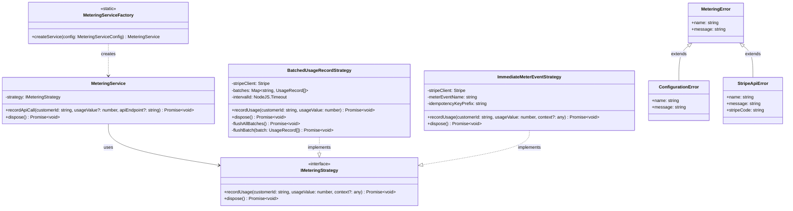

# API Metering Library for Stripe

A TypeScript library for metering API calls with Stripe's usage-based billing capabilities. This library provides a reusable, framework-agnostic solution for tracking API usage and reporting it to Stripe for billing purposes.

## Architecture



## Features

- Framework-agnostic: Works with any JavaScript/TypeScript backend
- Multiple reporting strategies:
  - **Immediate**: Report each API call to Stripe immediately as a meter event
  - **Batched**: Accumulate API calls and report them in batches as usage records
- Type-safe with comprehensive TypeScript definitions
- Built using best practices for code reusability and maintainability
- Defensive programming techniques to handle errors gracefully

## Installation

```bash
npm install api-metering-library stripe
```

## Quick Start

```typescript
import { MeteringServiceFactory } from 'api-metering-library';

// Create a metering service with the immediate strategy
const meteringService = MeteringServiceFactory.createService({
  stripeApiKey: 'sk_test_your_stripe_key',
  strategyType: 'immediate',
  meterEventName: 'api_call'
});

// Use the service to record API calls
async function handleApiRequest(req, res) {
  const customerId = req.headers['x-customer-id'];
  
  try {
    // Record the API call
    await meteringService.recordApiCall(customerId);
    
    // Process the API request...
    
    res.send({ success: true });
  } catch (error) {
    console.error('Error processing API request:', error);
    res.status(500).send({ error: 'An error occurred' });
  }
}
```

## Usage Examples

### Setting Up with Immediate Reporting Strategy

```typescript
import { MeteringServiceFactory } from 'api-metering-library';

const meteringService = MeteringServiceFactory.createService({
  stripeApiKey: process.env.STRIPE_SECRET_KEY || '',
  strategyType: 'immediate',
  meterEventName: 'api_call',
  idempotencyKeyPrefix: 'my-api'
});

// Record an API call with default usage value (1)
await meteringService.recordApiCall('cus_customer123');

// Record an API call with custom usage value and endpoint information
await meteringService.recordApiCall('cus_customer123', 5, '/api/data/query');
```

### Setting Up with Batched Reporting Strategy

```typescript
import { MeteringServiceFactory } from 'api-metering-library';

const meteringService = MeteringServiceFactory.createService({
  stripeApiKey: process.env.STRIPE_SECRET_KEY || '',
  strategyType: 'batched',
  batchIntervalMs: 30000, // 30 seconds
  maxBatchSize: 50,
  flushOnDispose: true
});

// Record multiple API calls
await meteringService.recordApiCall('cus_customer123');
await meteringService.recordApiCall('cus_customer456', 3);

// When shutting down your application, dispose the service to ensure all pending usage is reported
process.on('SIGTERM', async () => {
  await meteringService.dispose();
  process.exit(0);
});
```

### Express.js Middleware Example

```typescript
import express from 'express';
import { MeteringServiceFactory } from 'api-metering-library';

const app = express();
const meteringService = MeteringServiceFactory.createService({
  stripeApiKey: process.env.STRIPE_SECRET_KEY || '',
  strategyType: 'immediate',
  meterEventName: 'api_call'
});

// Middleware to meter all API calls
app.use(async (req, res, next) => {
  const customerId = req.headers['x-customer-id'] as string;
  
  if (customerId) {
    try {
      await meteringService.recordApiCall(customerId, 1, req.path);
    } catch (error) {
      console.error('Error recording API usage:', error);
      // Continue processing the request even if metering fails
    }
  }
  
  next();
});

app.get('/api/data', (req, res) => {
  res.json({ message: 'This API call was metered' });
});

app.listen(3000, () => {
  console.log('Server running on port 3000');
});
```

## API Reference

### MeteringServiceFactory

The factory class used to create instances of the `MeteringService`.

#### `createService(config: MeteringServiceConfig): MeteringService`

Creates a new `MeteringService` instance with the specified configuration.

### MeteringService

The main service class for recording API usage.

#### `recordApiCall(customerId: string, usageValue?: number, apiEndpoint?: string): Promise<void>`

Records an API call for the specified customer.

- `customerId`: The ID of the customer making the API call
- `usageValue`: The amount of usage to record (defaults to 1)
- `apiEndpoint`: Optional endpoint information for context

#### `dispose(): Promise<void>`

Disposes of the service, cleaning up any resources and ensuring all pending usage is reported (for batched strategies).

### Configuration Types

#### `ImmediateMeterEventConfig`

Configuration for the immediate meter event strategy:

- `stripeApiKey`: Stripe API key (secret key) used for authentication
- `strategyType`: Must be 'immediate'
- `meterEventName`: The name of the meter event that will be reported to Stripe
- `idempotencyKeyPrefix` (optional): Prefix for generating idempotency keys

#### `BatchedUsageRecordConfig`

Configuration for the batched usage record strategy:

- `stripeApiKey`: Stripe API key (secret key) used for authentication
- `strategyType`: Must be 'batched'
- `batchIntervalMs` (optional): The interval in milliseconds at which batched usage records will be sent to Stripe (default: 60000)
- `flushOnDispose` (optional): Whether to flush any pending usage records when the service is disposed (default: true)
- `maxBatchSize` (optional): Maximum number of usage records to accumulate before forcing a flush (default: 100)

## Error Handling

The library provides custom error types for better error handling:

- `MeteringError`: Base error class for all errors from the library
- `ConfigurationError`: Error related to invalid configuration
- `StripeApiError`: Error communicating with the Stripe API
- `InvalidInputError`: Error related to invalid input parameters
- `DependencyError`: Error related to missing dependencies

Example of handling errors:

```typescript
import { MeteringServiceFactory, StripeApiError } from 'api-metering-library';

try {
  await meteringService.recordApiCall(customerId);
} catch (error) {
  if (error instanceof StripeApiError) {
    console.error(`Stripe API error (${error.stripeCode}): ${error.message}`);
  } else {
    console.error('Error recording API call:', error);
  }
}
```

## Requirements

- Node.js >= 14
- Stripe account with metered billing configured

## License

MIT
